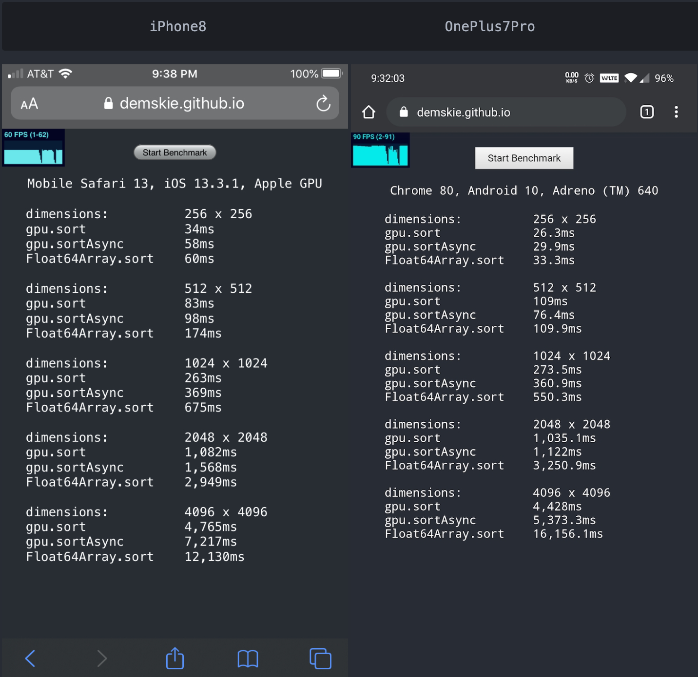

# gpu-sort

## GPU accelerated asynchronous sorting

[](https://travis-ci.org/demskie/gpu-sort) [](https://coveralls.io/github/demskie/gpu-sort?branch=master)
[](https://david-dm.org/demskie/gpu-sort#info=dependencies&view=table) [](https://badge.fury.io/js/gpu-sort)

## Why?

```
WebGL seems underutilized and sorting asynchronously is really handy.
```

## Installation

```bash
npm install gpu-sort
```

## Example

```js
import * as gpu from "gpu-sort";

let numbers = new Float64Array([5, 4, 3, 2, 1, 0]);

// sort in place
gpu.sort(numbers);

// sort in place asynchronously
gpu.sortAsync(numbers).then(() => console.log("sorted!"));
```

## NodeJS support

```js
import * as gpu from "gpu-sort";

// For NodeJS an emulation library must be provided as it doesn't support WebGL
gpu.setWebGLContext(require("gl")(1, 1));

// sort using webgl emulated context
gpu.sort(foo);
```

## Benchmarks

## https://demskie.github.io/gpu-sort



## Limitations

1. Only TypedArrays are supported.
2. When sorting 8bit and 16bit numbers GPU acceleration is disabled (as it seems rather pointless).
3. The maximum number of elements that can be sorted is constrained by the max texture width squared. For example `4096 ^ 2 = 16,777,216 (32bit)` or `4096 ^ 2 / 2 = 8,388,608 (64bit)`. This can be increased in the future by up to 8 times by multiplexing the data across multiple framebuffers.
