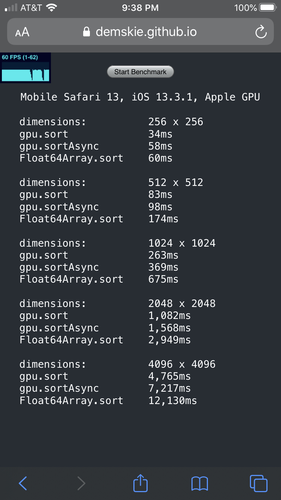
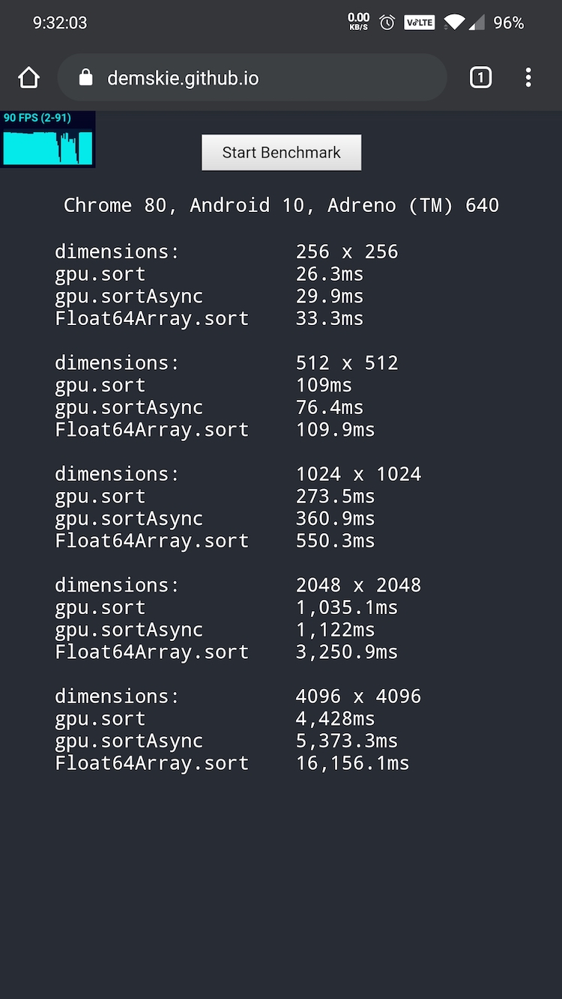

# gpu-sort

## GPU accelerated asynchronous sorter

[](https://travis-ci.org/demskie/gpu-sort) [](https://coveralls.io/github/demskie/gpu-sort?branch=master)
[](https://david-dm.org/demskie/gpu-sort#info=dependencies&view=table)

## Why?

```
WebGL seems underutilized and sorting asynchronously is really handy.
```

## Installation

```bash
npm install gpu-sort
```

## Example

```js
import * as gpu from "gpu-sort";

const foo = new Float64Array([42, 16, -3, 1]);

// sort in place
gpu.sort(foo);

// sort in place asynchronously
gpu.sortAsync(foo).then(() => {
  console.log(foo);
});
```

## NodeJS support

```js
// since Node does not natively support WebGL a third-party emulation library must be manually specified

import { setWebGLContext } from "gpu-sort";
setWebGLContext(require("gl")(1, 1));
```

## Benchmarks

## https://demskie.github.io

```
                iPhone8                               OnePlus7Pro
```



